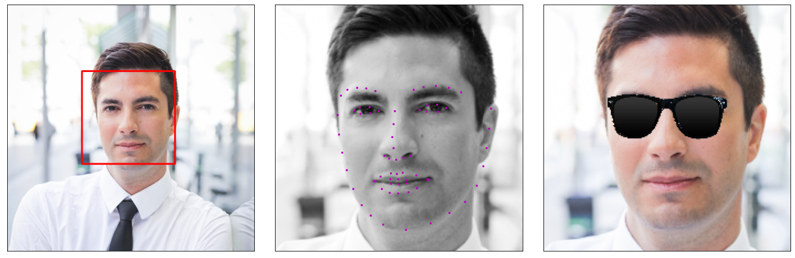

# Udacity Computer Vision Nanodegree

## Facial Keypoint Detection

Use image processing techniques and deep learning to recognize faces and facial keypoints, such as the location of the eyes and mouth on a face.



### Requirements

1. Download and install [Anaconda Python](http://www.anaconda.com)
2. Create and activate a [Conda environment](http://docs.conda.io/projects/conda/en/latest/user-guide/tasks/manage-environments.html)

### Set-up

Clone the project repository
```
git clone http://github.com/sdonatti/nd891-project-facial-keypoint-detection.git
```

Install required Python packages
```
cd nd891-project-facial-keypoint-detection
pip install -r requirements.txt -f https://download.pytorch.org/whl/torch_stable.html
```

Launch the project Jupyter Notebooks
```
jupyter notebook
```

__Notebook 1__ : Loading and Visualizing the Facial Keypoint Data

__Notebook 2__ : Defining and Training a Convolutional Neural Network (CNN) to Predict Facial Keypoints

__Notebook 3__ : Facial Keypoint Detection Using Haar Cascades and your Trained CNN

__Notebook 4__ : Fun Filters and Keypoint Uses

### License

This project is licensed under the [MIT License](LICENSE)